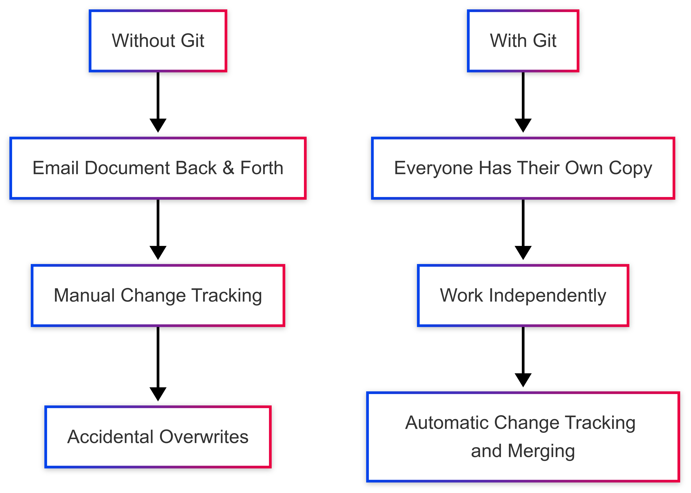
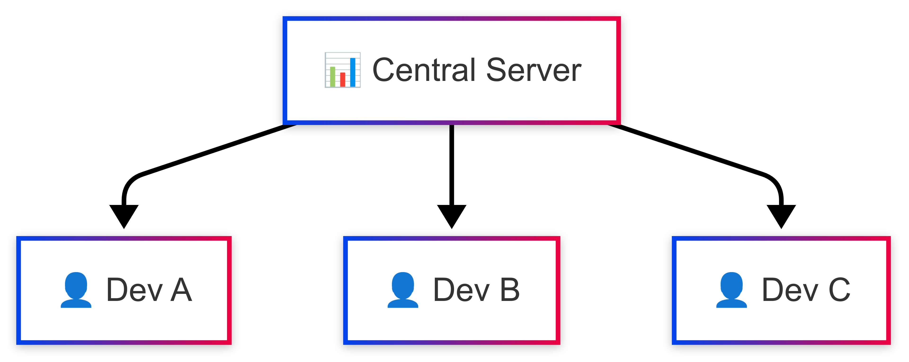
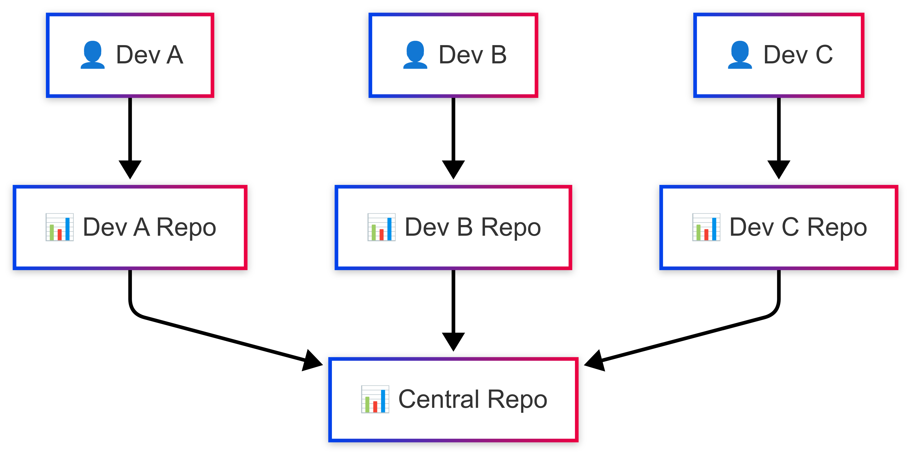
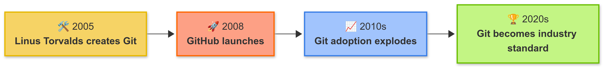

# Module 1: Introduction to Git & GitHub

## 🎯 Learning Objectives

By the end of this module, you will understand:
- What Git is and why version control matters
- The difference between Git and GitHub
- How distributed version control works
- When to use different version control systems

## 📖 What is Git?

**Git** is a distributed version control system that tracks changes in files and coordinates work between multiple people. Think of it as a sophisticated "save" system that:

- **Tracks every change** you make to your files
- **Remembers the history** of those changes
- **Allows multiple people** to work on the same project simultaneously
- **Merges changes** from different contributors intelligently
- **Helps you experiment** with new features without breaking existing code

### Real-World Analogy

Imagine you're writing a book with several co-authors:

<p align="center">

</p>

- **Without Git**: You email the document back and forth, manually tracking changes, and inevitably someone overwrites someone else's work
- **With Git**: Everyone has their own copy, can work independently, and changes are automatically tracked and merged

## 🤔 What is Version Control?

Version control is a system that:

1. **Records changes** to files over time
2. **Allows you to recall** specific versions later
3. **Shows who changed what** and when
4. **Enables collaboration** without conflicts
5. **Provides backup** and recovery capabilities

### Why Version Control Matters in Teams

**Without Version Control:**
```
📁 project/
├── final_version.doc
├── final_version_v2.doc
├── final_version_v2_john_edits.doc
├── final_version_v2_john_edits_FINAL.doc
├── final_version_v2_john_edits_FINAL_really_final.doc
└── 😵‍💫
```

**With Version Control:**
```
📁 project/
├── document.doc (tracked with full history)
└── 😌 (peace of mind)
```

**Team Benefits:**
- **No more "file ping-pong"**: Multiple people can work simultaneously
- **Complete change history**: See exactly what changed and why
- **Blame-free debugging**: Identify when bugs were introduced
- **Experimental freedom**: Try new ideas without fear
- **Automatic backups**: Your code is distributed across team members

## 🌐 What is GitHub?

**GitHub** is a cloud-based platform that hosts Git repositories and adds collaboration features on top of Git.

### Git vs GitHub: Key Differences

| Git | GitHub |
|-----|--------|
| Version control system | Hosting platform |
| Runs locally on your computer | Runs in the cloud |
| Command-line tool | Web interface + additional features |
| Tracks file changes | Adds collaboration tools |
| Free and open-source | Free tier + paid plans |

### GitHub's Additional Features

**Collaboration Tools:**
- **Pull Requests**: Propose and discuss changes before merging
- **Issues**: Track bugs, features, and tasks
- **Code Review**: Comment on and approve changes
- **Team Management**: Organize teams and permissions

**Project Management:**
- **Projects**: Kanban boards and project tracking
- **Milestones**: Group issues and PRs by release
- **Labels**: Categorize and filter work
- **Assignees**: Assign work to team members

**Automation:**
- **GitHub Actions**: CI/CD and workflow automation
- **Webhooks**: Integrate with external services
- **Apps**: Extend functionality with third-party tools

## 🏛️ Centralized vs Distributed VCS

### Centralized Version Control (Old School)

<p align="center">

</p>

**Examples**: Subversion (SVN), Perforce, CVS

**Characteristics:**
- Single central repository
- Developers check out files to work on them
- Changes must be committed to central server
- Network connection required for most operations
- Single point of failure

**Problems:**
- Server downtime = no work
- Network issues = no commits
- Limited offline work capability
- Potential for data loss if server fails

### Distributed Version Control (Modern Approach)

<p align="center">

</p>

**Examples**: Git, Mercurial, Bazaar

**Characteristics:**
- Every developer has a complete repository copy
- Work can be done entirely offline
- Multiple backup points automatically
- Peer-to-peer collaboration possible
- Central repository is by convention, not requirement

**Advantages:**
- No single point of failure
- Fast operations (everything is local)
- Flexible workflows
- Better branching and merging
- Complete history always available

## 🔍 Git vs GitHub vs GitLab vs Bitbucket

### Core Git Hosting Platforms

| Platform | Strengths | Best For |
|----------|-----------|----------|
| **GitHub** | Largest community, excellent UI/UX, rich ecosystem | Open source, public repos, team collaboration |
| **GitLab** | Built-in CI/CD, self-hosting options, integrated DevOps | Complete DevOps pipeline, enterprise |
| **Bitbucket** | Atlassian integration, free private repos for small teams | Teams using Jira/Confluence |
| **Azure DevOps** | Microsoft ecosystem integration | .NET development, enterprise Microsoft shops |

### When to Choose Each

**Choose GitHub if:**
- You want the largest developer community
- You're working on open source projects
- You need extensive third-party integrations
- You want the best mobile and desktop apps

**Choose GitLab if:**
- You need built-in CI/CD without configuration
- You want to self-host your repositories
- You need advanced security and compliance features
- You want an all-in-one DevOps platform

**Choose Bitbucket if:**
- You're already using Atlassian tools (Jira, Confluence)
- You need free private repositories for small teams
- You want integrated project management

## 🚀 Why Git Became the Standard

### Historical Context

<p align="center">

</p>

### Key Advantages

1. **Performance**: Optimized for speed and efficiency
2. **Flexibility**: Supports any workflow
3. **Reliability**: Cryptographic integrity of history
4. **Community**: Largest ecosystem and community support
5. **Tooling**: Excellent tools and IDE integration

## 🎯 Real-World Git Success Stories

### Open Source Projects
- **Linux Kernel**: 1000+ contributors, millions of lines of code
- **React**: Facebook's UI library with thousands of contributors
- **VS Code**: Microsoft's editor with massive community involvement

### Enterprise Usage
- **Google**: Manages Android and other projects
- **Microsoft**: Migrated from proprietary systems to Git
- **Netflix**: Coordinates microservices across teams

## 📋 Module 1 Exercises

### Exercise 1: Concept Check
Answer these questions to test your understanding:

1. What's the main difference between Git and GitHub?
2. Name three advantages of distributed version control over centralized.
3. In what scenarios would you choose GitLab over GitHub?

### Exercise 2: Research Task
Research and compare:
- Find one open source project on GitHub that interests you
- Look at its commit history, contributors, and issues
- Write a short summary of how the project uses Git/GitHub for collaboration

### Exercise 3: Team Discussion
Discuss with your team:
- What version control challenges have you faced in the past?
- How might Git address these challenges?
- What workflows might work best for your current projects?

## 🔗 Additional Resources

### Essential Reading
- [Git Official Documentation](https://git-scm.com/doc)
- [GitHub Guides](https://guides.github.com/)
- [Atlassian Git Tutorials](https://www.atlassian.com/git/tutorials)

### Interactive Learning
- [Learn Git Branching](https://learngitbranching.js.org/)
- [GitHub Learning Lab](https://lab.github.com/)
- [Git Immersion](http://gitimmersion.com/)

### Books
- "Pro Git" by Scott Chacon (free online)
- "Git Pocket Guide" by Richard E. Silverman
- "Version Control with Git" by Jon Loeliger

## ✅ Module 1 Checklist

Before moving to Module 2, ensure you can:

- [ ] Explain what Git is and why it's useful
- [ ] Describe the difference between Git and GitHub
- [ ] Understand the advantages of distributed version control
- [ ] Choose appropriate platforms for different use cases
- [ ] Articulate why version control matters for teams

---

**Next Module**: [Module 2: Setting Up Git](../02-setup/README.md)
