# Module 4: Branching & Merging

## 🎯 Learning Objectives

By the end of this module, you will be able to:
- Understand why branches are essential for team development
- Create, switch, and manage branches effectively
- Choose between merging and rebasing based on the situation
- Resolve merge conflicts confidently
- Implement effective branching strategies for your team

## 🌿 Why Use Branches?

### The Problem Without Branches

Imagine a team working on the same codebase without branches:


**Problems:**
- **Broken main branch**: New features break existing functionality
- **Integration nightmares**: Multiple developers stepping on each other
- **No experimentation**: Fear of breaking things prevents innovation
- **Hard to track**: Can't tell which changes belong to which feature

### The Solution: Branching

```mermaid
gitGraph
    commit id: "A - Initial"
    commit id: "B - Stable base"
    
    branch feature-1
    checkout feature-1
    commit id: "C - Dev 1 work"
    commit id: "D - More features"
    commit id: "E - Ready to merge"
    
    checkout main
    merge feature-1
    commit id: "F - Merged feature-1 ✅"
    
    branch feature-2
    checkout feature-2
    commit id: "Dev 2 work"
    commit id: "Another feature"
    
    checkout main
    commit id: "G - Other updates"
    merge feature-2
    commit id: "H - All features merged ✅"

```



**Benefits:**
- **Isolated development**: Each feature developed independently
- **Stable main**: Main branch stays deployable
- **Easy experimentation**: Try ideas without fear
- **Clear history**: Track which changes belong to which feature
- **Parallel work**: Multiple developers work simultaneously

## 🌱 Creating, Switching, and Managing Branches

### Basic Branch Operations

```bash
# List all branches
git branch                    # Local branches only
git branch -a                 # All branches (local and remote)
git branch -r                 # Remote branches only

# Create new branch
git branch feature-login      # Create branch (don't switch)
git checkout -b feature-login # Create and switch to branch
git switch -c feature-login   # Modern way to create and switch

# Switch between branches
git checkout main             # Switch to main
git switch main              # Modern way to switch
git checkout feature-login   # Switch to feature branch

# Rename branch
git branch -m old-name new-name    # Rename branch
git branch -m new-name             # Rename current branch

# Delete branch
git branch -d feature-login        # Delete (safe - prevents data loss)
git branch -D feature-login        # Force delete (use with caution)
git push origin --delete feature-login  # Delete remote branch
```

### Branch Naming Conventions

Good branch names are:
- **Descriptive**: Clearly explain the purpose
- **Consistent**: Follow team conventions
- **Hierarchical**: Use prefixes to categorize

**Common Patterns:**
```bash
# Feature branches
feature/user-authentication
feature/payment-integration
feat/responsive-design

# Bug fixes
bugfix/login-validation
hotfix/security-patch
fix/header-styling

# Releases
release/v1.2.0
release/2023-q4

# Experimental
experiment/new-ui-framework
spike/performance-testing

# Personal branches
username/feature-name
john/refactor-database
```

### Working with Remote Branches

```bash
# Push new branch to remote
git push -u origin feature-login

# Fetch all remote branches
git fetch origin

# Create local branch from remote
git checkout -b feature-login origin/feature-login
git switch -c feature-login origin/feature-login

# Track existing remote branch
git branch --set-upstream-to=origin/feature-login feature-login

# See tracking relationships
git branch -vv
```

## 🔄 Merging vs Rebasing

### Understanding the Difference

Both merging and rebasing integrate changes from one branch into another, but they do it differently:

**Merging**: Creates a merge commit that combines two branches
**Rebasing**: Replays commits from one branch onto another

### Merge Strategies

#### 1. Fast-Forward Merge


```bash
git checkout main
git merge feature-branch    # Fast-forward automatically
```

#### 2. Three-Way Merge (Merge Commit)


```bash
git checkout main
git merge feature-branch    # Creates merge commit
git merge --no-ff feature-branch  # Force merge commit
```

#### 3. Squash Merge


```bash
git checkout main
git merge --squash feature-branch
git commit -m "Add complete login feature"
```

### Rebasing

#### Basic Rebase


```bash
git checkout feature-branch
git rebase main
```

#### Interactive Rebase
```bash
# Rebase last 3 commits interactively
git rebase -i HEAD~3

# Rebase from specific commit
git rebase -i abc123
```

**Interactive Rebase Options:**
- `pick`: Keep commit as-is
- `reword`: Change commit message
- `edit`: Modify commit content
- `squash`: Combine with previous commit
- `drop`: Remove commit entirely

### When to Use Merge vs Rebase

| Situation | Recommendation | Reason |
|-----------|----------------|---------|
| **Feature branch → main** | Merge (with --no-ff) | Preserves feature branch context |
| **Updating feature branch** | Rebase | Keeps linear history |
| **Shared/public branches** | Merge only | Don't rewrite shared history |
| **Local cleanup** | Interactive rebase | Clean up before sharing |
| **Release branches** | Merge | Clear release boundaries |
| **Hotfix to main** | Merge or rebase | Either works, be consistent |

## 🔧 Conflict Resolution

### Understanding Merge Conflicts

Conflicts occur when:
- Two branches modify the same lines in a file
- One branch deletes a file while another modifies it
- Both branches add files with the same name

### Conflict Markers

```bash
<<<<<<< HEAD (current branch)
function login(username, password) {
    return authenticate(username, password);
}
=======
function login(user, pass) {
    return validateCredentials(user, pass);
}
>>>>>>> feature-branch (incoming changes)
```

### Resolving Conflicts Step-by-Step

#### 1. When Conflict Occurs
```bash
$ git merge feature-branch
Auto-merging src/auth.js
CONFLICT (content): Merge conflict in src/auth.js
Automatic merge failed; fix conflicts and then commit the result.
```

#### 2. Identify Conflicted Files
```bash
git status
# Shows:
# You have unmerged paths.
# Unmerged paths:
#   both modified:   src/auth.js
```

#### 3. Resolve the Conflict
```bash
# Open the file and manually resolve
# Remove conflict markers and choose the correct version
# Or use a merge tool:
git mergetool
```

#### 4. Mark as Resolved and Complete Merge
```bash
git add src/auth.js
git commit -m "Resolve merge conflict in authentication"
```

### Conflict Resolution Strategies

#### 1. Manual Resolution
```bash
# Original conflict:
<<<<<<< HEAD
function login(username, password) {
    return authenticate(username, password);
}
=======
function login(user, pass) {
    return validateCredentials(user, pass);
}
>>>>>>> feature-branch

# Resolved (combining both approaches):
function login(username, password) {
    return validateCredentials(username, password);
}
```

#### 2. Choose One Side
```bash
# Accept current branch (HEAD)
git checkout --ours filename.js

# Accept incoming branch
git checkout --theirs filename.js

# For entire merge
git merge -X ours feature-branch    # Prefer current branch
git merge -X theirs feature-branch  # Prefer incoming branch
```

#### 3. Using Merge Tools
```bash
# Configure merge tool (one-time setup)
git config --global merge.tool vimdiff
# or
git config --global merge.tool vscode

# Use merge tool
git mergetool
```

### Preventing Conflicts

1. **Communicate with team**: Coordinate who works on what
2. **Pull frequently**: Stay up-to-date with changes
3. **Keep changes small**: Smaller changes = fewer conflicts
4. **Refactor carefully**: Coordinate large refactoring efforts
5. **Use .gitattributes**: Define merge strategies for specific files

## 🏗️ Branching Strategies

### 1. Git Flow

**Best for**: Large projects with scheduled releases


**Branches:**
- **main**: Production-ready code
- **dev**: Integration branch for features
- **feature/***: Individual features
- **release/***: Release preparation
- **hotfix/***: Emergency fixes

**Commands:**
```bash
# Start new feature
git checkout develop
git checkout -b feature/new-login

# Finish feature
git checkout develop
git merge --no-ff feature/new-login
git branch -d feature/new-login

# Create release
git checkout develop
git checkout -b release/v1.2.0

# Finish release
git checkout main
git merge --no-ff release/v1.2.0
git checkout develop
git merge --no-ff release/v1.2.0
git tag v1.2.0
```

### 2. GitHub Flow

**Best for**: Continuous deployment, smaller teams


**Process:**
1. Create feature branch from main
2. Make changes and commit
3. Open pull request
4. Deploy and test
5. Merge to main

**Commands:**
```bash
# Start feature
git checkout main
git pull origin main
git checkout -b feature/new-feature

# Work and commit
git add .
git commit -m "Add new feature"
git push -u origin feature/new-feature

# After PR approval
git checkout main
git pull origin main
git branch -d feature/new-feature
```

### 3. GitLab Flow

**Best for**: Teams needing environment-specific branches


### 4. Simple Feature Branch Workflow

**Best for**: Small teams, simple projects

```bash
# Daily workflow
git checkout main
git pull origin main
git checkout -b fix/button-styling
# Make changes
git add .
git commit -m "Fix button styling issues"
git push -u origin fix/button-styling
# Create PR, get approval, merge
git checkout main
git pull origin main
git branch -d fix/button-styling
```

## 📊 Advanced Branch Management

### Branch Cleanup

```bash
# List merged branches
git branch --merged main

# Delete all merged branches
git branch --merged main | grep -v "main" | xargs git branch -d

# Delete remote tracking branches that no longer exist
git remote prune origin

# Clean up everything
git fetch -p && git branch -vv | awk '/: gone]/{print $1}' | xargs git branch -d
```

### Branch Protection

In GitHub, protect important branches:
1. Go to Settings → Branches
2. Add rule for `main` branch:
   - Require pull request reviews
   - Dismiss stale reviews
   - Require status checks
   - Restrict pushes
   - Require linear history

### Working with Large Branch Histories

```bash
# Shallow clone for large repos
git clone --depth 1 https://github.com/user/repo.git

# Unshallow if needed
git fetch --unshallow

# Sparse checkout for monorepos
git config core.sparseCheckout true
echo "frontend/*" > .git/info/sparse-checkout
git read-tree -m -u HEAD
```

## 📋 Module 4 Exercises

### Exercise 1: Basic Branching
1. Create a new repository
2. Create multiple feature branches
3. Make commits on each branch
4. Practice switching between branches
5. Merge branches back to main

### Exercise 2: Conflict Resolution
1. Create two branches from main
2. Modify the same lines in the same file on both branches
3. Attempt to merge and resolve the conflict
4. Try different conflict resolution strategies

### Exercise 3: Rebase Practice
1. Create a feature branch
2. Make commits on both main and feature branch
3. Rebase feature branch onto main
4. Compare the result with merging

### Exercise 4: Team Workflow Simulation
1. Simulate a team workflow with multiple developers
2. Use feature branches for different features
3. Practice pull requests and code review process
4. Handle multiple concurrent features

## 🔧 Troubleshooting Branch Issues

### "Branch not found" Error
```bash
# Update remote branch information
git fetch origin

# Check if branch exists remotely
git branch -r | grep branch-name

# Create local branch from remote
git checkout -b branch-name origin/branch-name
```

### Accidentally Committed to Wrong Branch
```bash
# Move last commit to correct branch
git checkout correct-branch
git cherry-pick wrong-branch
git checkout wrong-branch
git reset --hard HEAD~1
```

### Can't Delete Branch
```bash
# If branch is not fully merged
git branch -D branch-name  # Force delete

# If you're on the branch you want to delete
git checkout main
git branch -d branch-name
```

### Lost Commits After Bad Merge
```bash
# Find lost commits
git reflog
git log --all --oneline

# Recover lost commits
git checkout lost-commit-hash
git checkout -b recovery-branch
```

## 💡 Best Practices

### Branch Naming
- Use consistent naming conventions
- Include issue numbers: `feature/123-user-login`
- Make names descriptive but concise
- Use lowercase with hyphens

### Branch Lifecycle
- Create branches from latest main
- Keep branches short-lived (< 1 week)
- Regularly sync with main
- Delete branches after merging

### Merge Strategy
- Use consistent merge strategy across team
- Consider using `--no-ff` for feature merges
- Squash commits for cleaner history
- Write good merge commit messages

### Conflict Prevention
- Communicate about overlapping work
- Pull/rebase frequently
- Keep changes focused and small
- Use consistent code formatting

## ✅ Module 4 Checklist

Before moving to Module 5, ensure you can:

- [ ] Create and manage branches effectively
- [ ] Understand when to use merging vs rebasing
- [ ] Resolve merge conflicts confidently
- [ ] Implement a branching strategy appropriate for your team
- [ ] Use advanced branch management techniques
- [ ] Follow branching best practices
- [ ] Troubleshoot common branch-related issues

---

**Next Module**: [Module 5: Pull Requests & Code Review](../05-pull-requests/README.md)
