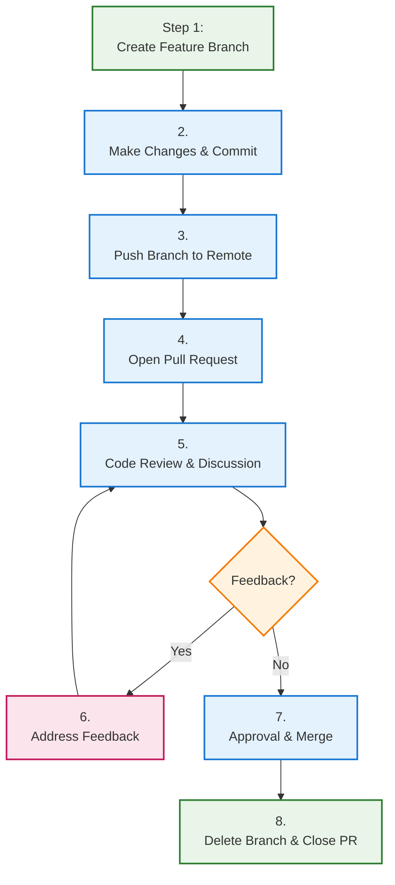
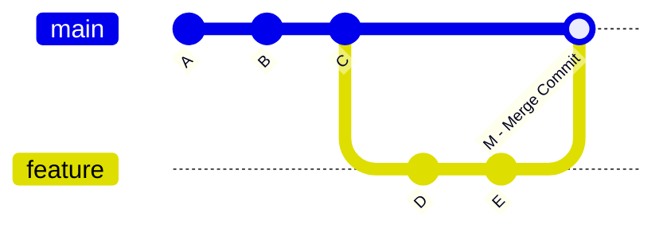
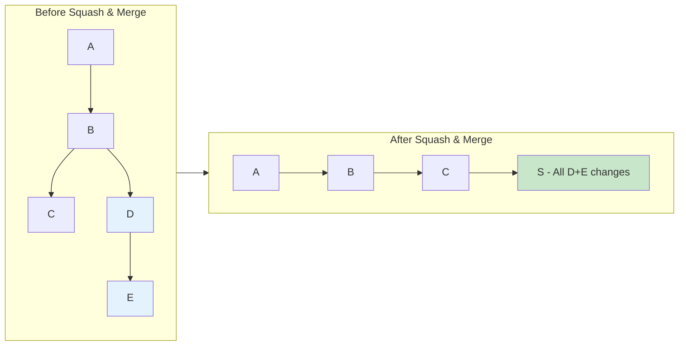
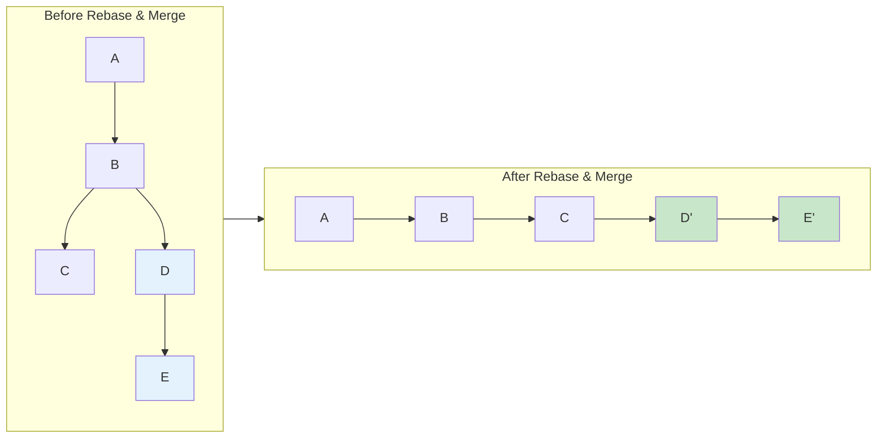

# Module 5: Pull Requests & Code Review

## 🎯 Learning Objectives

By the end of this module, you will be able to:
- Create effective pull requests that communicate clearly
- Conduct thorough and constructive code reviews
- Use GitHub's collaboration features effectively
- Link pull requests to issues for better project management
- Choose appropriate merge strategies for different scenarios

## 🔄 Understanding Pull Requests

### What is a Pull Request?

A **Pull Request (PR)** is a way to propose changes to a repository. It's called a "pull request" because you're asking the repository maintainer to "pull" your changes into their codebase.

**Key Benefits:**
- **Code Review**: Get feedback before merging changes
- **Discussion**: Collaborate on implementation details
- **Documentation**: Track what changed and why
- **Quality Control**: Catch bugs and issues early
- **Knowledge Sharing**: Learn from each other's code

### Pull Request vs Merge Request

| Platform | Term | Same Concept |
|----------|------|--------------|
| GitHub | Pull Request (PR) | ✅ |
| GitLab | Merge Request (MR) | ✅ |
| Bitbucket | Pull Request (PR) | ✅ |
| Azure DevOps | Pull Request (PR) | ✅ |

## 📝 Creating Effective Pull Requests

### The PR Lifecycle



### Step-by-Step: Creating Your First PR

#### 1. Create and Work on Feature Branch
```bash
# Create feature branch
git checkout dev
git pull origin dev
git checkout -b feature/add-user-profile
# or for bugfix
git checkout -b fix/login-validation

# Make your changes
echo "User profile feature" > user-profile.js
git add .
git commit -m "Add user profile functionality"

# Push to remote
git push -u origin feature/add-user-profile
```

#### 2. Open Pull Request on GitHub

**Via Web Interface:**
1. Go to your repository on GitHub
2. Click "Compare & pull request" (appears after pushing)
3. Or: Go to "Pull requests" → "New pull request"
4. Select branches: `base: dev` ← `compare: feature/add-user-profile`

### Writing Great PR Descriptions

#### PR Title Best Practices
```bash
# ✅ Good titles
"Add user authentication system"
"Fix responsive layout on mobile devices"
"Refactor database connection logic"
"Update dependencies to latest versions"

# ❌ Poor titles
"Fix stuff"
"Updates"
"Work in progress"
"Various changes"
```

#### PR Description Template
```markdown
## 📋 Description
Brief summary of what this PR does and why.

## 🎯 Type of Change
- [ ] Bug fix (non-breaking change which fixes an issue)
- [ ] New feature (non-breaking change which adds functionality)
- [ ] Breaking change (fix or feature that would cause existing functionality to not work as expected)
- [ ] Documentation update

## 🧪 How Has This Been Tested?
- [ ] Unit tests
- [ ] Integration tests
- [ ] Manual testing
- [ ] Cross-browser testing

## 📸 Screenshots (if applicable)
Before: [screenshot]
After: [screenshot]

## 🔗 Related Issues
Fixes #123
Related to #456

## ✅ Checklist
- [ ] My code follows the style guidelines of this project
- [ ] I have performed a self-review of my own code
- [ ] I have commented my code, particularly in hard-to-understand areas
- [ ] I have made corresponding changes to the documentation
- [ ] My changes generate no new warnings
- [ ] I have added tests that prove my fix is effective or that my feature works
- [ ] New and existing unit tests pass locally with my changes
```

### PR Size Best Practices

**Ideal PR Size:**
- **Small**: 1-50 lines changed
- **Medium**: 50-200 lines changed
- **Large**: 200+ lines (try to avoid)

**Tips for Right-Sized PRs:**
```bash
# Check your PR size before opening
git diff --stat dev...feature-branch

# Break large changes into smaller PRs
git checkout dev
git checkout -b feature/part-1
# Implement part 1
git checkout dev
git checkout -b feature/part-2
# Implement part 2 (depends on part 1)
```

## 👀 Code Review Best Practices

### The Code Review Mindset

**As a Reviewer:**
- **Be constructive**: Focus on the code, not the person
- **Be specific**: Point out exact issues and suggest solutions
- **Be timely**: Review PRs promptly (within 24-48 hours)
- **Be thorough**: Check functionality, style, performance, security

**As an Author:**
- **Be open**: Accept feedback gracefully
- **Be responsive**: Address comments promptly
- **Be clear**: Explain your decisions when needed
- **Be patient**: Good reviews take time

### What to Look for in Code Reviews

#### 1. Functionality
```javascript
// ✅ Good: Handles edge cases
function divide(a, b) {
    if (b === 0) {
        throw new Error('Division by zero');
    }
    return a / b;
}

// ❌ Poor: No error handling
function divide(a, b) {
    return a / b;
}
```

#### 2. Code Style and Readability
```javascript
// ✅ Good: Clear and readable
function calculateMonthlyPayment(principal, rate, years) {
    const monthlyRate = rate / 12;
    const numberOfPayments = years * 12;
    
    return principal * (monthlyRate * Math.pow(1 + monthlyRate, numberOfPayments)) /
           (Math.pow(1 + monthlyRate, numberOfPayments) - 1);
}

// ❌ Poor: Unclear variable names
function calc(p, r, y) {
    const mr = r / 12;
    const n = y * 12;
    return p * (mr * Math.pow(1 + mr, n)) / (Math.pow(1 + mr, n) - 1);
}
```

#### 3. Performance
```javascript
// ✅ Good: Efficient lookup
const userMap = new Map(users.map(user => [user.id, user]));
const foundUser = userMap.get(userId);

// ❌ Poor: O(n) for each lookup
const foundUser = users.find(user => user.id === userId);
```

#### 4. Security
```javascript
// ✅ Good: Parameterized query
const query = 'SELECT * FROM users WHERE id = ?';
db.query(query, [userId]);

// ❌ Poor: SQL injection vulnerability
const query = `SELECT * FROM users WHERE id = ${userId}`;
db.query(query);
```

### Review Comments Examples

#### Constructive Feedback
```markdown
# ✅ Good comments
"Consider using a Map here for O(1) lookups instead of Array.find() which is O(n)"

"This function is doing multiple things. Could we split it into smaller, single-purpose functions?"

"Great solution! Small suggestion: we could use destructuring here to make it more readable"

"This edge case isn't handled. What happens if the array is empty?"

# ❌ Poor comments
"This is wrong"
"Bad code"
"I don't like this"
"Change this"
```

#### Using GitHub Review Features
```markdown
# Suggesting changes
```suggestion
const users = await fetchUsers();
const activeUsers = users.filter(user => user.isActive);
```

# Asking questions
Why did we choose this approach over using a database query?

# Nitpick (minor suggestion)
Nit: Consider using camelCase for consistency with the rest of the codebase
```

## 🏷️ Using Labels, Assignees, and Reviewers

### GitHub Labels

**Common Label Categories:**
```
### Status:<br>
🟢 ready-for-review<br>
🟡 work-in-progress<br>
🔴 blocked<br>
⚪ draft

### Type:<br>
🐛 bug<br>
✨ feature<br>
📝 documentation<br>
🔧 maintenance

### Priority:<br>
🔴 high-priority<br>
🟡 medium-priority<br>
🟢 low-priority

### Size:<br>
S (small)<br>
M (medium)<br>
L (large)<br>
XL (extra-large)
```

### Assignees vs Reviewers

**Assignees**: Who is responsible for the PR
**Reviewers**: Who should review the code

### Review Requirements

Set up branch protection rules:
1. Go to Settings → Branches
2. Add rule for main branch
3. Configure:
   - ✅ Require pull request reviews before merging
   - ✅ Require review from code owners
   - ✅ Dismiss stale reviews when new commits are pushed
   - ✅ Require status checks to pass

## 🔗 Linking PRs to Issues

### Why Link PRs to Issues?

- **Traceability**: Connect code changes to requirements
- **Auto-closing**: Issues close automatically when PR merges
- **Context**: Reviewers understand the purpose
- **Project management**: Track progress visually

### Linking Syntax

#### Auto-closing Keywords
```markdown
# These will close the issue when PR merges
Fixes #123
Closes #123
Resolves #123

# These create links but don't auto-close
Related to #123
See #123
Ref #123

# Multiple issues
Fixes #123, #456, #789
Fixes #123 and #456
```

#### Cross-repository References
```markdown
# Reference issue in another repo
Fixes user/other-repo#123

# Reference PR in another repo
Related to user/other-repo#456
```

### Using GitHub Issues Effectively

#### Issue Templates
Create `.github/ISSUE_TEMPLATE/bug_report.md`:
```markdown
---
name: Bug report
about: Create a report to help us improve
title: '[BUG] '
labels: bug
assignees: ''
---

**Describe the bug**
A clear and concise description of what the bug is.

**To Reproduce**
Steps to reproduce the behavior:
1. Go to '...'
2. Click on '....'
3. Scroll down to '....'
4. See error

**Expected behavior**
A clear and concise description of what you expected to happen.

**Screenshots**
If applicable, add screenshots to help explain your problem.

**Environment:**
- OS: [e.g. iOS]
- Browser [e.g. chrome, safari]
- Version [e.g. 22]
```

## 🔀 Merge Strategies

### Understanding Merge Options

GitHub provides three merge strategies:

#### 1. Merge Commit (Default)


**When to use:**
- Want to preserve feature branch history
- Working with multiple contributors on a feature
- Need to see when features were integrated

#### 2. Squash and Merge


**When to use:**
- Want clean, linear history
- Feature has many small/messy commits
- Individual commits aren't meaningful

#### 3. Rebase and Merge


**When to use:**
- Want linear history without merge commits
- Individual commits are meaningful
- Small, clean feature branches

### Choosing the Right Strategy

| Scenario | Recommended Strategy | Reason |
|----------|---------------------|---------|
| Small bug fix | Squash and merge | Clean history |
| Large feature with meaningful commits | Merge commit | Preserve context |
| Hot fix | Rebase and merge | Linear history |
| Multiple contributors | Merge commit | Preserve attribution |
| Prototype/experiment | Squash and merge | Hide experimentation |

### Repository Settings

Configure default merge strategy:
1. Go to Settings → General
2. Scroll to "Pull Requests"
3. Choose default merge options:
   - ✅ Allow merge commits
   - ✅ Allow squash merging
   - ✅ Allow rebase merging
4. Set default to your preferred strategy

## 🤖 Automating PR Workflows

### GitHub Actions for PRs

Create `.github/workflows/pr.yml`:
```yaml
name: PR Workflow
on:
  pull_request:
    branches: [ main ]

jobs:
  test:
    runs-on: ubuntu-latest
    steps:
    - uses: actions/checkout@v3
    - name: Setup Node.js
      uses: actions/setup-node@v3
      with:
        node-version: '18'
    - name: Install dependencies
      run: npm ci
    - name: Run tests
      run: npm test
    - name: Run linting
      run: npm run lint
```

### PR Templates

Create `.github/pull_request_template.md`:
```markdown
## Summary
Brief description of changes

## Testing
- [ ] Unit tests added/updated
- [ ] Manual testing completed
- [ ] All tests pass

## Checklist
- [ ] Code follows style guidelines
- [ ] Self-review completed
- [ ] Documentation updated
- [ ] No new warnings generated
```

## 📋 Module 5 Exercises

### Exercise 1: Create Your First PR
1. Fork a repository or create a new one
2. Create a feature branch
3. Make meaningful changes
4. Write a comprehensive PR description
5. Open the pull request

### Exercise 2: Practice Code Review
1. Find open PRs in public repositories
2. Practice giving constructive feedback
3. Look for different types of issues (functionality, style, performance)
4. Practice using GitHub's review features

### Exercise 3: Link PRs to Issues
1. Create issues for bugs or features
2. Create PRs that reference these issues
3. Use different linking keywords
4. Observe how they close automatically

### Exercise 4: Merge Strategy Comparison
1. Create multiple small PRs
2. Try different merge strategies
3. Compare the resulting Git history
4. Understand when each strategy is appropriate

## 🔧 Troubleshooting PR Issues

### PR Shows Unexpected Changes
```bash
# Check what's being compared
git log --oneline dev..feature-branch

# Make sure you're branching from the right place
git merge-base dev feature-branch

# Rebase if needed to clean up
git rebase dev
```

### Can't Merge PR
```bash
# Common reasons and solutions:

# 1. Merge conflicts
git checkout feature-branch
git pull origin dev
# Resolve conflicts, then
git add .
git commit -m "Resolve merge conflicts"
git push

# 2. Failing checks
# Check the "Checks" tab in GitHub
# Fix issues locally and push

# 3. Outdated branch
git checkout feature-branch
git pull origin dev
git push
```

### Review Comments Not Showing
- Ensure you're on the "Files changed" tab
- Comments might be on specific lines
- Check if comments are "pending" (not submitted yet)
- Refresh the page

### Accidentally Merged Wrong Branch
```bash
# If you have admin access, you can revert
git revert -m 1 <merge-commit-hash>
git push origin dev

# Or contact repository admin
```

## 💡 Advanced PR Techniques

### Draft Pull Requests

**How to create a Draft PR using GitHub UI:**
1. Push your feature branch to GitHub.
2. Go to your repository on GitHub.
3. Click "Pull requests" → "New pull request".
4. Select your base and compare branches.
5. Click the dropdown arrow on the "Create pull request" button and select "Create draft pull request".
6. Fill in the PR details and submit.

**How to mark a Draft PR as ready for review:**
1. Open your draft pull request on GitHub.
2. Click the "Ready for review" button at the top of the PR page.

**Use draft PRs when:**
- Work is in progress
- Want early feedback on direction
- Need to trigger CI for testing
- Collaborating on implementation

### Converting Issues to PRs
```bash
# Reference issue in branch name
git checkout -b fix/123-login-bug

# Link in PR description
echo "Fixes #123" >> pr-description.md
```

### Cross-Fork PRs
When contributing to open source:
```bash
# 1. Fork the repository on GitHub
# 2. Clone your fork
git clone git@github.com:yourusername/original-repo.git

# 3. Add upstream remote
git remote add upstream git@github.com:original-owner/original-repo.git

# 4. Create feature branch
git checkout -b feature/awesome-feature

# 5. Keep your fork updated
git fetch upstream
git checkout dev
git merge upstream/dev
git push origin dev
```

### Using Co-authors
```bash
# Add co-authors to commits
git commit -m "Add new feature

Co-authored-by: Jane Doe <jane@example.com>
Co-authored-by: John Smith <john@example.com>"
```

## 📊 PR Metrics and Analytics

### Tracking Team Performance

**Useful Metrics:**
- **PR Lead Time**: Time from creation to merge
- **Review Time**: Time to first review
- **Merge Rate**: Percentage of PRs that get merged
- **Revert Rate**: Percentage of PRs that get reverted

**GitHub Insights:**
1. Go to repository → Insights
2. Check "Pulse" for recent activity
3. Use "Contributors" to see individual metrics
4. "Code frequency" shows commit patterns

### Setting Up CODEOWNERS
Create `.github/CODEOWNERS`:
```
# Global owners
* @admin-team

# Frontend code
/frontend/ @frontend-team
*.js @frontend-team
*.css @frontend-team

# Backend code
/backend/ @backend-team
*.py @backend-team

# Documentation
*.md @docs-team
/docs/ @docs-team

# Security-related files
/security/ @security-team
```

## ✅ Module 5 Checklist

Before moving to Module 6, ensure you can:

- [ ] Create well-structured pull requests with clear descriptions
- [ ] Conduct thorough and constructive code reviews
- [ ] Use GitHub's collaboration features (labels, assignees, reviewers)
- [ ] Link PRs to issues effectively
- [ ] Choose appropriate merge strategies for different scenarios
- [ ] Set up branch protection rules and review requirements
- [ ] Troubleshoot common PR issues
- [ ] Use advanced PR features like drafts and co-authors

---

**Next Module**: [Module 6: GitHub Features](../06-github-features/README.md)
