# Module 8: Semantic Versioning & Releases

## 🎯 Learning Objectives

By the end of this module, you will be able to:
- Understand and implement semantic versioning (SemVer)
- Create effective release management strategies
- Automate changelog generation
- Integrate CI/CD with version management
- Handle pre-releases and release candidates

## 📏 Understanding Semantic Versioning

### What is Semantic Versioning?

Semantic Versioning (SemVer) is a versioning scheme that uses a three-part number: **MAJOR.MINOR.PATCH**

```mermaid
flowchart TD
    Version[v2.1.3] --> Major[2 - MAJOR]
    Version --> Minor[1 - MINOR] 
    Version --> Patch[3 - PATCH]
    
    Major --> MajorDesc[🚨 Breaking Changes<br/>Not backward compatible<br/>Example: v1.0.0 → v2.0.0]
    Minor --> MinorDesc[✨ New Features<br/>Backward compatible<br/>Example: v2.0.0 → v2.1.0]
    Patch --> PatchDesc[🐛 Bug Fixes<br/>Backward compatible<br/>Example: v2.1.0 → v2.1.1]
    
    %% Styling
    classDef versionNode fill:#e1f5fe,stroke:#01579b,stroke-width:3px
    classDef majorNode fill:#ffebee,stroke:#c62828,stroke-width:2px
    classDef minorNode fill:#e8f5e8,stroke:#2e7d32,stroke-width:2px
    classDef patchNode fill:#fff3e0,stroke:#ef6c00,stroke-width:2px
    classDef exampleNode fill:#f3e5f5,stroke:#7b1fa2,stroke-width:1px
    
    class Version versionNode
    class Major,MajorDesc majorNode
    class Minor,MinorDesc minorNode
    class Patch,PatchDesc patchNode
    class E1,E2,E3,E4,E5 exampleNode
```


### SemVer Rules

1. **MAJOR**: Increment when you make incompatible API changes
2. **MINOR**: Increment when you add functionality in a backward compatible manner
3. **PATCH**: Increment when you make backward compatible bug fixes

### Examples of Version Changes

```bash
# Starting version: v1.2.3

# Bug fix (patch)
v1.2.3 → v1.2.4
# Examples: Fix login validation, resolve memory leak

# New feature (minor)
v1.2.4 → v1.3.0
# Examples: Add dark mode, new API endpoint

# Breaking change (major)
v1.3.0 → v2.0.0
# Examples: Remove deprecated API, change function signatures
```


### Pre-release Versions

```bash
# Alpha versions (early development)
v2.0.0-alpha.1
v2.0.0-alpha.2

# Beta versions (feature complete, testing)
v2.0.0-beta.1
v2.0.0-beta.2

# Release candidates (ready for production)
v2.0.0-rc.1
v2.0.0-rc.2

# Final release
v2.0.0
```

## 🏷️ Git Tagging for Releases

### Creating Release Tags

```bash
# Create annotated tag (recommended)
git tag -a v1.2.0 -m "Release version 1.2.0"

# Push tags to remote
git push origin v1.2.0
git push origin --tags
```

## 📋 Release Management Strategies

### GitHub Flow Release

```bash
# Simple release process for GitHub Flow
# 1. Ensure main is stable
git checkout main
git pull origin main

# 2. Run final tests
npm test
npm run build

# 3. Tag and release
git tag -a v1.2.0 -m "Release version 1.2.0"
git push origin v1.2.0

# 4. Create GitHub release
gh release create v1.2.0 --title "Release v1.2.0" --notes-file CHANGELOG.md
```

## 📝 Changelog Generation

### Manual Changelog Template

```markdown
# Changelog

## [1.2.0] - 2024-03-15

### Added
- User authentication system
- Dark mode toggle
- API rate limiting

### Changed
- Improved dashboard performance by 40%
- Updated user interface design

### Fixed
- Fixed memory leak in real-time updates
- Resolved login validation on mobile devices

### Security
- Updated dependencies to patch security vulnerabilities
```

### Conventional Commits

```bash
# Commit message format:
feat(auth): add OAuth2 integration
fix(ui): resolve button alignment on mobile
docs: update API documentation
```

## 🤖 CI/CD Integration

### GitHub Actions Release Workflow

```yaml
# .github/workflows/release.yml
name: Release

on:
  push:
    tags: ['v*']

jobs:
  release:
    runs-on: ubuntu-latest
    steps:
    - name: Checkout
      uses: actions/checkout@v3
    
    - name: Setup Node.js
      uses: actions/setup-node@v3
      with:
        node-version: '18'
    
    - name: Install dependencies
      run: npm ci
    
    - name: Run tests
      run: npm test
    
    - name: Build
      run: npm run build
    
    - name: Create GitHub Release
      run: |
        gh release create "${{ github.ref_name }}" \
          --title "Release ${{ github.ref_name }}" \
          --notes-file CHANGELOG.md
      env:
        GH_TOKEN: ${{ secrets.GITHUB_TOKEN }}
```

## 📦 Release Distribution

### GitHub Releases

```bash
# Create release with assets
gh release create v1.2.0 \
  --title "Release v1.2.0" \
  --notes-file RELEASE_NOTES.md \
  dist/app-linux.tar.gz \
  dist/app-windows.zip

# Mark as pre-release
gh release create v1.2.0-beta.1 \
  --prerelease \
  --title "Beta Release v1.2.0-beta.1"
```

## 📊 Release Analytics

### Tracking Release Metrics

```bash
# Release frequency
git log --tags --simplify-by-decoration --pretty="format:%ai %d" | head -10

# Time between releases
git log --tags --simplify-by-decoration --pretty="format:%ct" | \
  awk 'NR>1{print ($prev-$1)/86400 " days"} {prev=$1}'
```

## 📋 Module 8 Exercises

### Exercise 1: Semantic Versioning Practice
1. Create a project with initial version 1.0.0
2. Make different types of changes (patch, minor, major)
3. Practice creating pre-release versions

### Exercise 2: Release Workflow
1. Implement a release process
2. Create release branches
3. Practice tagging and releasing

### Exercise 3: Automated Changelog
1. Set up conventional commits
2. Configure automated changelog generation
3. Create release notes

### Exercise 4: CI/CD Pipeline
1. Create GitHub Actions workflow for releases
2. Implement automated version bumping
3. Set up automated testing

## 🔧 Troubleshooting Releases

### Common Issues

```bash
# Wrong version tagged
git tag -d v1.2.0                    # Delete locally
git push origin --delete v1.2.0      # Delete remotely
git tag -a v1.2.0 correct-commit -m "Fix version tag"
git push origin v1.2.0

# Release published too early
gh release edit v1.2.0 --draft        # Convert to draft
gh release delete v1.2.0 --yes        # Delete release
```

## 💡 Release Best Practices

### Planning
- Plan releases around milestone boundaries
- Communicate release schedules
- Test releases in staging environment
- Have rollback plans ready

### Quality
- Always run tests before releasing
- Use feature flags for risky changes
- Write clear release notes
- Provide migration guides for breaking changes

### Automation
- Automate repetitive release tasks
- Validate releases automatically
- Use consistent release processes
- Monitor release success metrics

## ✅ Module 8 Checklist

Before moving to Module 9, ensure you can:

- [ ] Understand and apply semantic versioning principles
- [ ] Create and manage Git tags for releases
- [ ] Implement release management strategies
- [ ] Generate and maintain changelogs
- [ ] Set up automated release pipelines
- [ ] Handle pre-releases and release candidates
- [ ] Distribute releases across platforms
- [ ] Track release metrics
- [ ] Troubleshoot common release issues
- [ ] Follow release best practices

---

**Next Module**: [Module 9: Team Best Practices](../09-best-practices/README.md)
