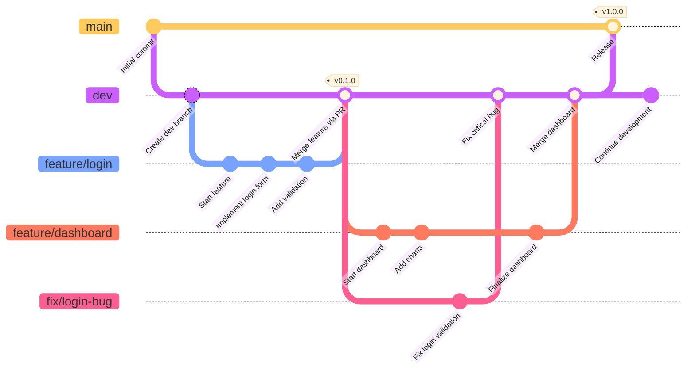
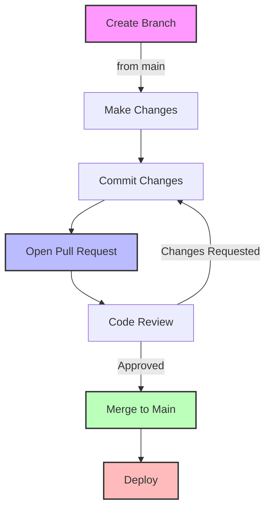

# Git Workflow Diagrams

This directory contains visual diagrams to help you understand Git workflows and concepts. These diagrams are meant to be printed or used as reference when learning Git.

## Branching Strategies Diagram


## Git Workflow Overview



## Git States and Areas

```
┌────────────────────────────────────────────────────────────────────┐
│                           Working Directory                         │
│  ┌────────────────────┐  ┌────────────────┐  ┌─────────────────┐   │
│  │  Untracked Files   │  │ Modified Files │  │ Unmodified Files│   │
│  └────────┬───────────┘  └───────┬────────┘  └────────┬────────┘   │
│           │                      │                     │            │
│           │  git add             │  git add            │            │
│           ▼                      ▼                     │            │
│  ┌──────────────────────────────────────────┐          │            │
│  │              Staging Area                │          │            │
│  │     (Files ready to be committed)        │          │            │
│  └────────────────────┬─────────────────────┘          │            │
│                       │                                │            │
│                       │  git commit                    │            │
│                       ▼                                │            │
│  ┌──────────────────────────────────────────┐          │            │
│  │           Local Repository               │          │            │
│  │ (Committed files in .git directory)      │          │            │
│  └────────────────────┬─────────────────────┘          │            │
└───────────────────────┼──────────────────────────────────────────────┘
                        │
                        │  git push
                        ▼
┌──────────────────────────────────────────────┐
│            Remote Repository                 │
│      (GitHub, GitLab, Bitbucket, etc)        │
└──────────────────────────────────────────────┘
```

## Merge vs Rebase Visual Comparison

### Merge Approach

```
Initial state:
main:    A --- B --- C
                     \
feature:              D --- E

After merge:
main:    A --- B --- C --- F (merge commit)
                     \     /
feature:              D --- E
```

### Rebase Approach

```
Initial state:
main:    A --- B --- C
                     \
feature:              D --- E

After rebase:
main:    A --- B --- C
                     \
feature:              D' --- E'
```

## Git Commands Flow

```
┌─────────────────┐     ┌─────────────────┐     ┌─────────────────┐
│  Working Tree   │     │  Staging Area   │     │   Repository    │
└────────┬────────┘     └────────┬────────┘     └────────┬────────┘
         │                       │                       │
         │  1. git add           │  2. git commit        │
         ├──────────────────────►├──────────────────────►│
         │                       │                       │
         │  5. git checkout      │                       │
         │◄──────────────────────┼───────────────────────┤
         │                       │                       │
         │                       │  3. git reset HEAD    │
         │                       │◄──────────────────────┤
         │                       │                       │
         │  4. git checkout --   │                       │
         │◄──────────────────────┤                       │
         │                       │                       │
         └───────────────────────┴───────────────────────┘
```

## Conflict Resolution Process

```
┌─────────────────────────────────────────────────────────────────┐
│ Step 1: Identify Conflict                                        │
│ ┌─────────────────────────────────────────────────────────────┐ │
│ │ $ git merge feature-branch                                   │ │
│ │ Auto-merging file.txt                                        │ │
│ │ CONFLICT (content): Merge conflict in file.txt               │ │
│ │ Automatic merge failed; fix conflicts and then commit.       │ │
│ └─────────────────────────────────────────────────────────────┘ │
└─────────────────────────────────────────────────────────────────┘
                               │
                               ▼
┌─────────────────────────────────────────────────────────────────┐
│ Step 2: Examine Conflict                                         │
│ ┌─────────────────────────────────────────────────────────────┐ │
│ │ <<<<<<< HEAD (current branch)                               │ │
│ │ This is the current branch's version                        │ │
│ │ =======                                                     │ │
│ │ This is the feature branch's version                        │ │
│ │ >>>>>>> feature-branch                                      │ │
│ └─────────────────────────────────────────────────────────────┘ │
└─────────────────────────────────────────────────────────────────┘
                               │
                               ▼
┌─────────────────────────────────────────────────────────────────┐
│ Step 3: Resolve Conflict                                         │
│ ┌─────────────────────────────────────────────────────────────┐ │
│ │ This is the manually resolved version combining both changes│ │
│ └─────────────────────────────────────────────────────────────┘ │
└─────────────────────────────────────────────────────────────────┘
                               │
                               ▼
┌─────────────────────────────────────────────────────────────────┐
│ Step 4: Mark as Resolved                                         │
│ ┌─────────────────────────────────────────────────────────────┐ │
│ │ $ git add file.txt                                          │ │
│ └─────────────────────────────────────────────────────────────┘ │
└─────────────────────────────────────────────────────────────────┘
                               │
                               ▼
┌─────────────────────────────────────────────────────────────────┐
│ Step 5: Complete the Merge                                       │
│ ┌─────────────────────────────────────────────────────────────┐ │
│ │ $ git commit -m "Resolve merge conflict in file.txt"         │ │
│ └─────────────────────────────────────────────────────────────┘ │
└─────────────────────────────────────────────────────────────────┘
```

## Git Lifecycle Diagram

```mermaid
stateDiagram-v2
    [*] --> Untracked: New file created
    Untracked --> Staged: git add
    Staged --> Unmodified: git commit
    Unmodified --> Modified: Edit file
    Modified --> Staged: git add
    Unmodified --> Untracked: git rm
    Unmodified --> [*]: Remove file
    
    state Untracked {
        description: Files Git doesn't track
    }
    
    state Staged {
        description: Files ready for commit
    }
    
    state Unmodified {
        description: Tracked files, no changes since commit
    }
    
    state Modified {
        description: Tracked files with changes
    }
```

## GitHub Flow Diagram



These diagrams are designed to help visualize Git workflows and concepts. You can use them as reference when working through the playbook modules or during team training sessions.
